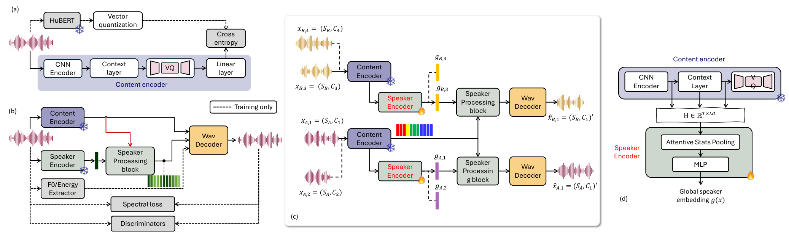

# VOSSA: Voiceprint Optimization for Streaming Speech Architectures (Interspeech 2026)

 

This is the official repository for the paper

"VOSSA: Voiceprint Optimization for Streaming Speech Architectures"

by [Mu-Ruei Tseng](https://github.com/Morris88826), [Waris Quamer](https://github.com/warisqr007), [Ghady Nasrallah](https://github.com/Ghadynasrallah), [Ricardo Gutierrez-Osuna](https://scholar.google.com/citations?user=UnuQfEwAAAAJ&hl=en)

Department of Computer Science & Engineering, Texas A&M University

## News
**2026:** VOSSA accepted at Interspeech 2026.

## Introduction

Real-time voice conversion (VC) systems commonly rely on pretrained speaker embeddings from automatic speaker verification (ASV) models. While effective for speaker discrimination, these embeddings are trained to remain stable across phonetic and prosodic variations within-speaker, which may conflict with frame-level acoustic generation in streaming constraints. To address this issue, we propose VOSSA, a speaker representation framework that extracts speaker information from intermediate content encoder layers and aggregates using attentive statistics pooling. The embedding is trained jointly with VC objectives, removing the need for a separate speaker encoder.

For more information, please check out our [Demo Page](https://morris88826.github.io/VOSSA/).

## Highlights

- **19% fewer parameters** than TVTSyn (132.4M vs. 162.8M) by eliminating the external speaker encoder
- **Real-time streaming** with RTF ≈ 0.25 and end-to-end latency ≈ 73 ms
- **Best normalized target-speaker similarity** across six evaluation datasets
- **Improved pitch accuracy** — lowest pitch MAE and highest Pearson CC among all baselines
- **Better vowel preservation** — lowest Wasserstein distance to ground-truth F1 distributions for high, mid, and low vowels

## Code

Source code coming soon.

## Citation

BibTeX will be available upon official publication at Interspeech 2026.
